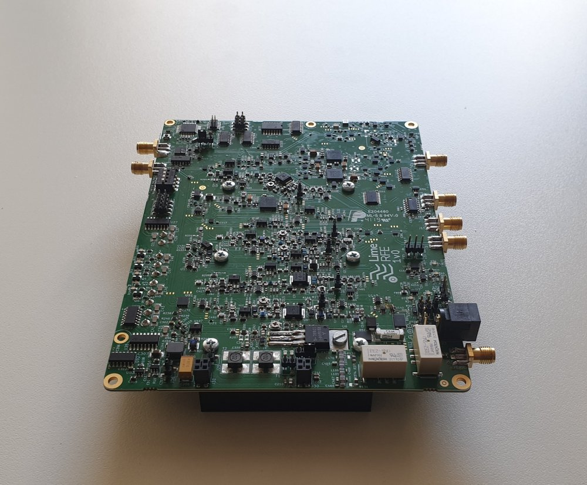

Introduction
############

.. toctree::
   :maxdepth: 3
   :hidden:
   
   Introduction <self>
   user/index
   reference/index
   developer/index
   advanced/index

Lime RF Front-End (LimeRFE) is an open hardware RF front-end module with support circuitry to augment the LimeSDR family of boards and LimeNET Micro, providing a complete solution that addresses applications ranging from amateur radio to standards-compliant cellular networks.

A single LimeRFE covers three very different sets of bands: cellular, amateur radio and wideband. The exact band used at any given time is software selectable. By making the RF front-end definable in software, LimeRFE is the next step in the evolution of software-defined radio.

LimeRFE provides not only transmit and receive amplification, but also band-specific filtering and integrates duplexers for cellular band FDD operation. In addition to which it provides power and VSWR (requires external directional coupler) metering, and configuration is possible via either USB or direct connection to a LimeSDR board.

Specifications
**************

RX
==
.. table:: Maximum input signals for RX
      
   +------------------+-------------------------+--------------------------+-------------+
   | **Channel**      | **Channel Description** | **RF Input Power [dBm]** | **Comment** |
   +==================+=========================+==========================+=============+
   | HAM 30           | HF                      | 10                       |             |
   +------------------+-------------------------+                          |             |
   | HAM 50 and 70    | 6 and 4 m               |                          |             |
   +------------------+-------------------------+                          |             |
   | HAM 145          | 2 m                     |                          |             |
   +------------------+-------------------------+                          |             |
   | HAM 220          | 1.25 m                  |                          |             |
   +------------------+-------------------------+                          |             |
   | HAM 435          | 70 cm                   |                          |             |
   +------------------+-------------------------+                          |             |
   | Wideband 1000    | 1 – 1000 MHz            |                          |             |
   +------------------+-------------------------+--------------------------+-------------+
   | HAM 915          | 33 cm                   | 20                       |             |
   +------------------+-------------------------+                          |             |
   | HAM 1280         | 23 cm                   |                          |             |
   +------------------+-------------------------+                          |             |
   | HAM 2400         | 13 cm                   |                          |             |
   +------------------+-------------------------+                          |             |
   | HAM 3500         | /                       |                          |             |
   +------------------+-------------------------+                          |             |
   | Wideband 4000    | 1 – 4 GHz               |                          |             |
   +------------------+-------------------------+--------------------------+-------------+
   | Cellular Band 1  | LTE Band 1              | 20                       |             |
   +------------------+-------------------------+                          |             |
   | Cellular Band 2  | LTE Band 2/             |                          |             |
   |                  |                         |                          |             |
   |                  | PCS-1900                |                          |             |
   +------------------+-------------------------+                          |             |
   | Cellular Band 3  | LTE Band 3/             |                          |             |
   |                  |                         |                          |             |
   |                  | DCS-1800                |                          |             |
   +------------------+-------------------------+                          |             |
   | Cellular Band 7  | LTE Band 7              |                          |             |
   +------------------+-------------------------+                          |             |
   | Cellular Band 38 | LTE Band 38             |                          |             |
   +------------------+-------------------------+--------------------------+-------------+

.. note::
   The received signal will be amplified at the connector SDR RX (J1), care must be taken about that the maximum input RF power of the SDR connected is not exceeded.

TX
==

.. table:: Maximum input signals for TX

   +------------------+-------------------------+--------------------------+-------------+
   | **Channel**      | **Channel Description** | **RF Input Power [dBm]** | **Comment** |
   +==================+=========================+==========================+=============+
   | HAM 30           | HF                      | 13                       | TBC         |
   +------------------+-------------------------+--------------------------+-------------+
   | HAM 50 and 70    | 6 and 4 m               | 13                       | TBC         |
   +------------------+-------------------------+--------------------------+-------------+
   | HAM 145          | 2 m                     | 15                       | TBC         |
   +------------------+-------------------------+--------------------------+-------------+
   | HAM 435          | 70 cm                   | 13                       | TBC         |
   +------------------+-------------------------+--------------------------+-------------+
   | Wideband 1000    | 1 – 1000 MHz            | 0                        | TBC         |
   +------------------+-------------------------+--------------------------+-------------+
   | HAM 1280         | 23 cm                   | 5                        | TBC         |
   +------------------+-------------------------+--------------------------+-------------+
   | HAM 2400         | 13 cm                   | 10                       | TBC         |
   +------------------+-------------------------+--------------------------+-------------+
   | HAM 3500         | /                       | 5                        | TBC         |
   +------------------+-------------------------+--------------------------+-------------+
   | Wideband 4000    | 1 – 4 GHz               | 5                        | TBC         |
   +------------------+-------------------------+--------------------------+-------------+
   | Cellular Band 1  | LTE Band 1              | 10                       | TBC         |
   +------------------+-------------------------+--------------------------+-------------+
   | Cellular Band 2  | LTE Band 2/             | 10                       | TBC         |
   |                  | PCS-1900                |                          |             |
   +------------------+-------------------------+--------------------------+-------------+
   | Cellular Band 3  | LTE Band 3/             | 10                       | TBC         |
   |                  | DCS-1800                |                          |             |
   +------------------+-------------------------+--------------------------+-------------+
   | Cellular Band 7  | LTE Band 7              | 10                       | TBC         |
   +------------------+-------------------------+--------------------------+-------------+
   | Cellular Band 38 | LTE Band 38             |                       10 | TBC         |
   +------------------+-------------------------+--------------------------+-------------+

Digital Interface
=================

I2C, USB 2.0 or 3.0?

Power Supply
============

Power sources table with voltages and max power?

Environmental
=============

.. list-table:: 
   :header-rows: 1
   :stub-columns: 1

   * - Parameter
     - Value
     - Notes
   * - Operating Temperature
     - ??
     - What grade?
   * - Storage Temperature
     - -40 °C to +85 °C
     - N/A
   * - Operating Humidity
     - 10% to 90% RH  
     - Non-condensing

Mechanical
==========

size and weight?

Features
********

Devices
=======

Clock system
============

Memory
======

General user inputs/outputs:
============================

Connections
===========

Purchasing
**********

Please see the  `Lime Micro website`_ for purchasing options.

Regulatory
**********

RoHS
====

This product is RoHS compliant and does not contain hazardous substances as defined by Directive 2011/65/EU.

WEEE
====

This product must be disposed of properly according to local regulations. Do not dispose of with general household waste.

RF Transmission Notice
======================

.. warning::
   Operating RF transmitting equipment may require appropriate licensing. Users are responsible for ensuring compliance with local regulations. Unauthorised transmission may result in legal penalties.

.. _Lime Micro Website: https://limemicro.com/sdr/limerfe/